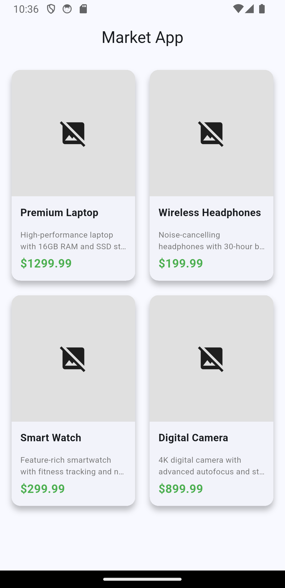

# Market App



## Overview

The Market App is a Flutter application that displays a grid of products with detailed information. Each product card shows an image, name, price, and description in a clean, modern interface.

## Features

- **Product Grid Display**: Responsive grid layout showing multiple products
- **Product Cards**: Each card displays:
  - Product image with error handling
  - Product name and description
  - Price in green currency format
- **Material Design**: Uses Material 3 design system
- **Responsive Layout**: Adapts to different screen sizes
- **Error Handling**: Graceful fallback for broken image links

## Technical Details

- **Framework**: Flutter
- **UI Components**: Material Design 3
- **Layout**: GridView with custom ProductCard widgets
- **Image Handling**: Network images with error builders
- **Styling**: Rounded corners, elevation, and consistent spacing

## App Structure

```text
lib/
├── main.dart              # Main app entry point
└── widgets/
    └── product_card.dart  # Custom product card widget
```

## Usage

The app launches directly to a product grid where users can browse available items. Each product is displayed in a card format with all relevant information visible at a glance.

## Development Notes

- Uses placeholder images from via.placeholder.com
- Implements flexible layout to prevent overflow errors
- Follows Flutter best practices for widget composition
- Clean separation of concerns with reusable widgets


